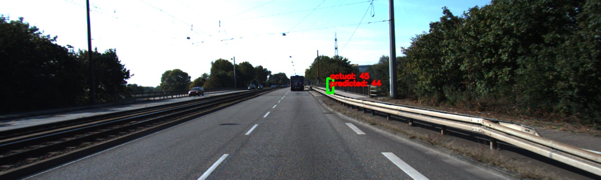
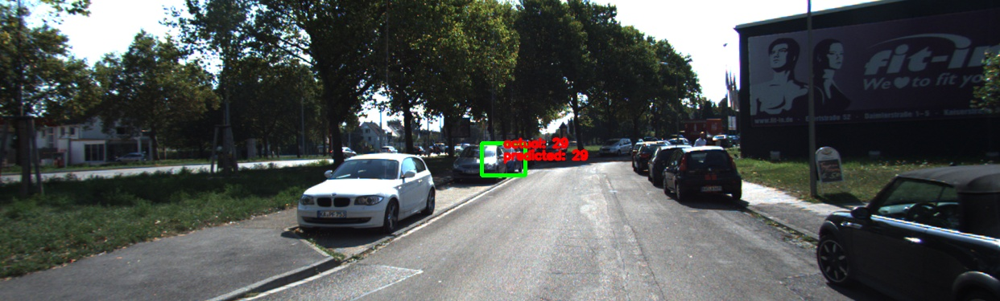
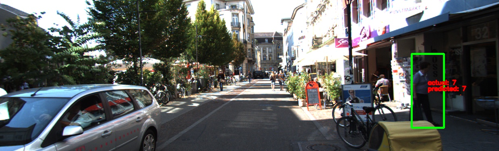
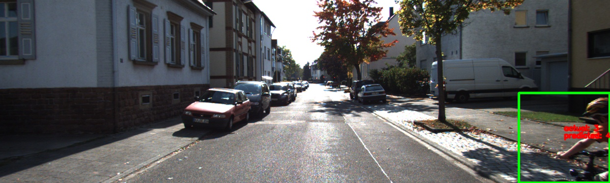
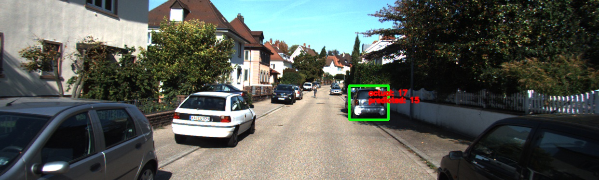

## Purpose
To estimate distance to objects (cars, pedestrians, trucks) in the scene on the basis of detection information

## Overview
Train a deep learning model that takes in bounding box coordinates of the detected object and estimates distance to the object.

Input: bounding box coordinates (xmin, ymin, xmax, ymax) <br/>
Output: distance (z)

## Usage
To train and test the models, execute the following from `distance-estimator` directory, unless mentioned otherwise

### Training
1. (Optional) Use `hyperopti.py` for hyperparameter optimization. Choose the hyperparameters you would like to try out. (Default model inside hyperopti trains on two gpus, change it if you want.) More info on hyperoptimization [here](https://github.com/maxpumperla/hyperas)
2. You can use result of 1. and edit `train.py` accordingly. Otherwise, use `train.py` to define your own model, choose hyperparameters, and start training!

### Inference
1. Use `inference.py` to generate predictions for the test set.
```
python inference.py --modelname=generated_files/model@1535470106.json --weights=generated_files/model@1535470106.h5
```
2. Use `prediction-visualizer.py` to visualize the predictions.
```
cd KITTI-distance-estimation/
python prediction-visualizer.py
```

### Results







## Appendix
### Prepare Data
1. **Download KITTI dataset**
```shell
# get images
wget https://s3.eu-central-1.amazonaws.com/avg-kitti/data_object_image_2.zip
unzip data_object_image_2.zip

# get annotations
wget https://s3.eu-central-1.amazonaws.com/avg-kitti/data_object_label_2.zip
unzip data_object_label_2.zip
```

Organize the data as follows:

```shell
KITTI-distance-estimation
|-- original_data
    |-- test_images
    |-- train_annots
    `-- train_images
```

2. **Convert annotations from .txt to .csv**<br/>
We only have train_annots. Put all information in the .txts in a .csv

```shell
python generate-csv.py --input=original_data/train_annots --output=annotations.csv
```

The annotations contain the following information

```
Values    Name      Description
----------------------------------------------------------------------------
   1    type         Describes the type of object: 'Car', 'Van', 'Truck',
                     'Pedestrian', 'Person_sitting', 'Cyclist', 'Tram',
                     'Misc' or 'DontCare'
   1    truncated    Float from 0 (non-truncated) to 1 (truncated), where
                     truncated refers to the object leaving image boundaries
   1    occluded     Integer (0,1,2,3) indicating occlusion state:
                     0 = fully visible, 1 = partly occluded
                     2 = largely occluded, 3 = unknown
   1    alpha        Observation angle of object, ranging [-pi..pi]
   4    bbox         2D bounding box of object in the image (0-based index):
                     contains left, top, right, bottom pixel coordinates
   3    dimensions   3D object dimensions: height, width, length (in meters)
   3    location     3D object location x,y,z in camera coordinates (in meters)
   1    rotation_y   Rotation ry around Y-axis in camera coordinates [-pi..pi]
   1    score        Only for results: Float, indicating confidence in
                     detection, needed for p/r curves, higher is better.
```

3. **Generate dataset for distance estimation**<br/>
Using only `annotations.csv` (file generated using `train_annots`), split the dataset into `train.csv` and `test.csv` set.

```shell
python generate-depth-annotations.py
```

This dataset contains the following information:
`filename, xmin, ymin, xmax, ymax, angle, xloc, yloc, zloc`

Organize your data as follows
```
KITTI-distance-estimation
|-- original_data
|    |-- test_images
|    |-- train_annots
|    `-- train_images
`-- distance-estimator/
    |-- data
        |-- test.csv
        `-- train.csv
```

4. **Visualize the dataset**<br/>
Use `visualizer.py` to visualize and debug your dataset. Edit `visualizer.py` as you want to visualize whatever data you want.

### Training
1. Use `hyperopti.py` for hyperparameter optimization. Choose the hyperparameters you would like to try out. More info on hyperoptimization [here](https://github.com/maxpumperla/hyperas)
2. Use result of 1. and edit `train.py` accordingly. Use `train.py` to actually train your model
3. Use `inference.py` to generate predictions for the test set.
4. Use `prediction-visualizer.py` to visualize the predictions.

### TODO
1. Save models in `hyperopti.py` so train.py wont be necessary (waiting on hyperas issue)
2. Handle num_gpus (cannot access global variables inside create_model)

### Acknowledgements
[KITTI Vision Benchmark Suite](http://www.cvlibs.net/datasets/kitti/)
